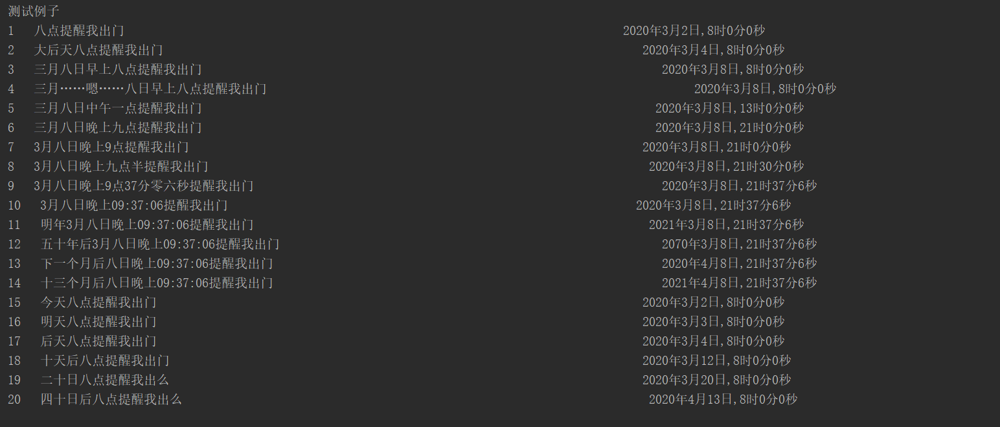

# TimeExtractor
针对口语进行时间抽取并标准化

### 特性

- 具有一定的时间段推理能力，如十天后xxx
- 支持中文数字，如三月八日早上九点xxx
- 针对口语化语句设计，如明天xxx，后天xxx，三月……嗯……八日……，九点半等口语描述

### 缺点

因为这个库只是满足我自己的需求问题，用于解析蕴含预约/提醒意图的句子，并不是通用的时间抽取器，所以具有如下的缺点：

- 只能解析未来的时间，比如，昨天xxx，前天xxx等
- 对于时间跨度过大，解析能力不足，比如一万天后提醒我xxxx
- 目前只是基于规则进行解析，可能有一定的不足

### How To Use

see [demo.py](demo.py)

```python
from time_extractor import Extractor
extractor = Extractor()
text = "三月……嗯……八日早上八点提醒我出门"
time_list, timestamp = extractor.extract(text) 
print(time_list, timestamp)
# Output: [年，月，日，时，分，秒], 时间戳
# [2020,3,8,8,0,0] ,1583625600.0
```


### Demo

测试日期为2020.3.2




项目更新与否取决于我有没有新需求，开源是为了方便ctrl+c，如果对你也有帮助，希望你能点一个star。